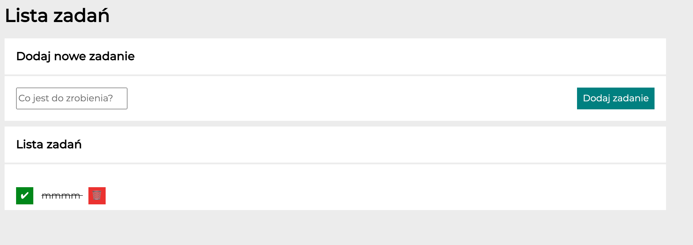

# Task manager
## Demo
https://martaszymborska.github.io/task-manager/
## Description
Simple task manager. How does it work?
- you can add new task
- remove task if it's no longer on your to do list
- checked task once accomplished

**What I was practicing:**
- HTML
- CSS styling 
- Grid and flex
- arrow functions JS

